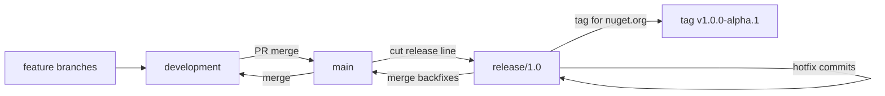
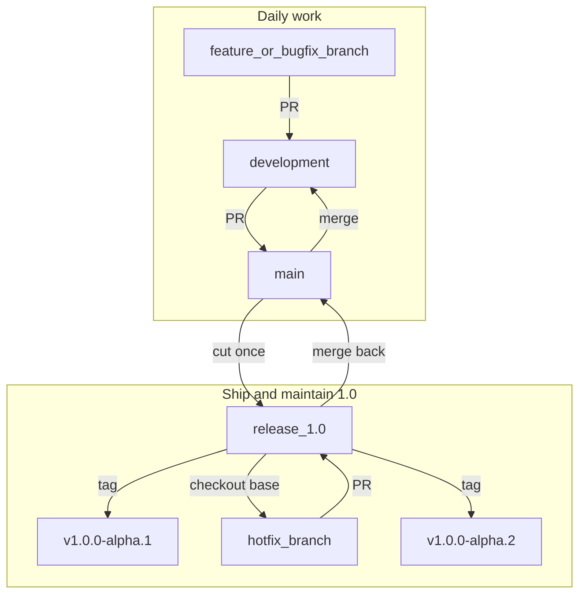

# Contributing to ZVec.NET

First off, thank you for considering contributing to ZVec.NET! Our goal is to bring the blazing fast performance of Alibaba's ZVec to the .NET ecosystem, and community support makes that possible.

## Repository Architecture

This repository contains two main components:
1. **ZVec.NET (C#):** The managed .NET SDK — DI-first (`IZvecFactory` / `IZvecCollection`), async APIs, zero-allocation vector paths.
2. **ZVec.Native (C++):** CMake wrapper that builds Alibaba's official fat C API (`zvec_c_api`) from the `external/zvec` submodule.

Native code lives at `src/Native/ZVec.Native` (header: `external/zvec/src/include/zvec/c_api.h`). Windows build steps: [`src/Native/ZVec.Native/steps.md`](src/Native/ZVec.Native/steps.md).

Design details (Factory/Builder, DI, LINQ-on-results, concurrency gates): [`ZVec.NET-Project-Plan.md`](ZVec.NET-Project-Plan.md) §§3, 7, 8.4.

## Local Development Setup

Because this project relies on a native C++ engine, you cannot simply press "Run" in Visual Studio immediately. You must initialize the C++ submodules first.

1. **Clone the repository with submodules:**
   If you already cloned the repo normally, run:
   `git submodule update --init --recursive`
   *(This downloads the upstream Alibaba C++ code into `src/Native/ZVec.Native/external/zvec`.)*

2. **C++ Compilation:**
   Ensure you have CMake and a C++ compiler (Visual Studio 2026 with C++ Desktop Development workload, or GCC/Clang on Linux/macOS) installed. On Windows, follow [`src/Native/ZVec.Native/steps.md`](src/Native/ZVec.Native/steps.md) (Ninja + Scoop tools: `ninja`, `make`, `mingw`, `perl`). Quick path from Developer PowerShell for VS 2026:

   ```powershell
   cd src\Native\ZVec.Native
   .\_configure_ninja.bat
   .\_build_ninja.bat
   ```

   The DLL is written under `src/Native/ZVec.Native/build\` (e.g. `build\external\zvec\bin\zvec_c_api.dll`).

3. **Deploy win-x64 into runtimes (local):** use `src/Native/ZVec.Native/_build_and_deploy.bat` (or copy the DLL to `src/Core/ZVec.NET/runtimes/win-x64/native/`).
4. **Other RIDs / mobile:** see `build/ci/` (`build-android.sh`, `build-ios.sh`, `deploy-native.sh`) and GitHub Actions workflows. MAUI embeds matching natives via `samples/ZVec.NET.Samples.Maui/ZVec.Native.targets`.

## Branching & releases

### Topology



| Branch | Role | Parent / cut from |
|--------|------|-------------------|
| **`development`** | Integration / daily work; PRs land here | — |
| **`main`** | Stable trunk after PR from `development` | Receives merges from `development` |
| **`release/1.0`** | Maintenance line for all **1.0.x** (alpha → RTM → patches) | **Cut from `main`** |
| Future | `release/1.1`, `release/2.0`, … | Each cut from `main` when that train starts |

**Default locked:** parent of every `release/*` is **`main`**, not `development`. Hotfixes go on `release/1.0`, then merge back to `main` and `development` when the fix still applies upstream.

Naming: long-lived **`release/1.0`** (not one branch per patch). Patch/prerelease bumps are **tags** on that branch (`v1.0.0-alpha.2`, `v1.0.0`, `v1.0.1`).

### Critical: branch name ≠ NuGet version

There is **no** git branch `release/1.0.0-alpha.1+zvec.0.5.1`. Contributors never “pull the version string as a branch.”

| Concept | Example | Where it lives |
|---------|---------|----------------|
| Git branch (train) | `release/1.0` | Git |
| Git tag (one ship) | `v1.0.0-alpha.1` | Git (**no** `+` metadata in the tag name) |
| NuGet / csproj Version | `1.0.0-alpha.1+zvec.0.5.1` | `ZVec.NET.csproj` + README |

`+zvec.0.5.1` is **build metadata** (native pin), not a branch name. Do **not** put TFM or branch names into the version string.

### Versions (current 1.0 train)

| Piece | Value |
|-------|--------|
| ZVec C++ pin | `0.5.1` |
| SDK SemVer | `1.0.0-alpha.1` |
| NuGet package | `1.0.0-alpha.1+zvec.0.5.1` |
| First git tag | `v1.0.0-alpha.1` |

### Daily work vs ship/maintain



### Normal contributions (features / most bugs)

```text
1. git fetch && git checkout development && git pull
2. git checkout -b feature/fix-filter-null   # or bugfix/...
3. PR → development
4. Maintainer merges development → main when ready
5. release/1.0 gets the fix either by:
   - already containing it (if cut after the merge), or
   - cherry-pick / merge from main into release/1.0 if the 1.0 train still needs it
```

Contributor does **not** create a second “development” from `release/1.0`. Work off **`development`**.

Never commit directly on `main` or `release/*`.

### Hotfix for an already-shipped 1.0 train

Bug in a published alpha/RTM on the 1.0 line:

```text
1. git fetch && git checkout release/1.0 && git pull
2. git checkout -b hotfix/1.0-null-filter
3. PR → release/1.0   (not → development)
4. On release/1.0: bump Version in csproj (e.g. 1.0.0-alpha.2+zvec.0.5.1)
5. Tag v1.0.0-alpha.2 on release/1.0 → publish CI
6. Merge release/1.0 → main, then main → development (so the fix is not lost)
```

If the bug is truly 1.0-only (already fixed differently upstream), leave it on `release/1.0` only.

### Multiple release trains at once

```text
release/1.0   ← hotfixes for 1.0.x customers (tags v1.0.*)
release/1.1   ← hotfixes for 1.1.x
development   ← next work (will become 1.2 or 2.0)
```

There is **one** shared `development`. Each `release/X.Y` only receives:

- its initial cut from `main`, plus
- **hotfix/** PRs aimed at that release line, plus
- selective cherry-picks from `main` when you choose to back-port.

There is **no** merge of “different development branches into different `release/X.x.x-alpha+zvec…` branches.”

### What Actions run where

| Workflow | Runs on | Publishes to nuget.org? |
|----------|---------|-------------------------|
| `build-managed.yml` | `main`, `development`, `release/**`, all PRs | No — core + tests only (not `samples/`) |
| `build-native.yml` / `build-native-mobile.yml` | same (+ path filters) | No |
| `pack.yml` | `release/**`, tags `v*`, manual | No — natives first, then managed with RID artifacts, then pack |
| `publish-nuget.yml` | tags `v*` only | **Yes** — commit must be on `release/*` |

**Pack:** desktop natives finish → managed downloads `zvec-native-{rid}` and runs integration tests → pack. Day-to-day managed on `development` / `main` does not wait for natives (integration Skip if missing). Only **nuget.org publish** is release-branch-gated. See [`build/ci/README.md`](build/ci/README.md).

### NuGet publish & upstream announce (maintainers)

- PackageId **`ZVec.NET`** (not the GitHub repo name). nuget.org owner: **AdamSystems**.
- Trusted Publishing: workflow `publish-nuget.yml`, repo `ahmedSamir50/AdamSystems.ZVec.NET`.
- **Publish only from tags whose commit is on `release/*`** (CI enforces this). Manual `workflow_dispatch` on publish is for emergencies only — still prefer a tag on `release/*`.
- After the package is live: Community SDK issue on [alibaba/zvec](https://github.com/alibaba/zvec) (Project Plan §9.4).

### First publish on `release/1.0`

Confirm Pack CI is green on `release/1.0`, then:

```bash
git fetch origin
git checkout release/1.0 && git pull
# csproj Version must be 1.0.0-alpha.1+zvec.0.5.1 (SemVer + native pin; no TFM in the version)
git tag -a v1.0.0-alpha.1 -m "ZVec.NET 1.0.0-alpha.1 (native zvec 0.5.1)"
git push origin v1.0.0-alpha.1
```

Tag name is **`v1.0.0-alpha.1`** only (no `+zvec…`). That push runs `publish-nuget.yml` → nuget.org.

## How to Contribute

1. **Branching:** See [Branching & releases](#branching--releases) above (`feature/*` / `bugfix/*` off **`development`**).
2. **Pull Requests:** Submit normal PRs against **`development`**. Hotfixes for a shipped line target **`release/X.Y`**.
3. **API shape:** Prefer interfaces + `AddZVec*` DI registration over new static entry points.
   - **Typed (preferred for app code):** `IZvecCollection<T>`, `ZVec.NET.Mapping` attributes, `ZVecCollectionSchemaBuilder.From<T>()`, expression filters, `AddZVecCollection<T>`. `EnsureSchema` is **additive only** (never auto-drop).
   - **Dynamic (advanced):** `IZvecCollection`, `ZVecDoc`, string field names, fluent `ZVecFilterBuilder`, `AddZVecCollection(string key, …)`.
   - Implement **complete** `type.h` enums and **all** index-param types (Hnsw, HnswRabitq, Ivf, Flat, DiskAnn, Vamana, Invert, Fts) — do not defer indexes.
4. **Coverage target:** Wrap the **Vector Database** C++ / `zvec_c_api` surface and match DB sections of [llms-full](https://zvec.org/llms-full.txt) (see plan §2.0). Do **not** implement AI Integration (embeddings, MCP, skills, model rerankers) in this package. Snapshot used for audits: `docs/llms-full.txt`.
5. **Async & concurrency:** Public surface is async-first. P/Invoke is sync — always go through collection read/write gates; never add unbounded `Task.Run` around native calls. Honor `CancellationToken` while waiting on gates.
6. **Zero allocation:** On hot paths (`Query` / `Insert`), use `ReadOnlySpan<float>` / `ReadOnlyMemory<float>` and `MemoryHandle`. Do not introduce `new float[]` copies on vector passing paths. Typed ODM mapping is a managed edge cost — keep heavy work on the existing `ZVecDoc` native path.
7. **Enums / ABI:** Match numeric values to upstream `zvec/db/type.h` and `c_api.h`. If the C header omits a define (e.g. `HNSW_RABITQ = 4`), use the `type.h` value — do not invent new numbers. Document every enum in the project plan Appendix A.
8. **LINQ:** Apply LINQ to **results** only. Expression filters on `IZvecCollection<T>` translate to native filter strings — do **not** add a custom `IQueryable` provider over the engine.
9. **Testing:** Run the `ZVec.NET.Tests` project. Unit tests cover pure managed logic (including Mapping / typed façade). Native-backed integration/memory tests use the real `zvec_c_api` binary and **Skip** when it is not available locally or on PR/push managed CI. **Pack CI** passes `require_native` so win-x64 / linux-x64 / osx-arm64 integration tests run against CI-built artifacts (failures fail the pipeline). `NativeLibraryResolver.SetMockLibrary` is reserved for missing-path / failure-path tests only. Typed ODM overhead: `TypedOdmOverheadBench` in `ZVec.NET.Benchmarks`.

If you are unsure where to start, check the Issues tab for "good first 
issue" tags!