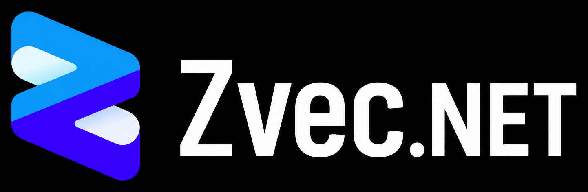

# ZVec.NET

{ width="360" }

**Production .NET SDK for [Alibaba ZVec](https://github.com/alibaba/zvec)** — DI, typed ODM, async APIs, SafeHandles, full indexes/FTS, and mobile RIDs.

> **Beta** — `1.0.0-beta.6+zvec.0.7.0`. Native AOT compatible. APIs may still evolve. PackageId **`ZVec.NET`** on nuget.org (distinct from the unrelated NuGet package [`Zvec`](https://www.nuget.org/packages/Zvec)).

## Why ZVec.NET?

| Feature | What it means |
|---------|----------------|
| **DI-first** | `AddZVec()` / `AddZVecCollection<T>()` for ASP.NET Core, MAUI, Blazor Server |
| **Typed ODM** | POCOs via `ZVec.NET.Mapping` — schema `From<T>()`, expression filters |
| **Sync + async** | Lowest-latency sync; `ValueTask` async for hosts |
| **Pin-based vectors** | `ReadOnlyMemory<float>` on hot paths |
| **Safe native lifecycle** | `SafeZvecHandle`; factory shutdown disposes tracked collections |
| **Cross-platform natives** | Single NuGet with `runtimes/{rid}/native/` |
| **Full DB coverage** | HNSW, Flat, IVF, RaBitQ, DiskANN, Vamana, Invert, FTS; hybrid search; RRF/Weighted rerankers |

## Start here

1. [Install](getting-started/install.md)
2. [Quick start](getting-started/quick-start.md)
3. [DI hosts](guides/di.md) or [typed ODM](guides/odm.md)
4. [Examples](examples/index.md) — in-repo hosts + [external demos/POCs](examples/demos-and-pocs.md)
5. [Index concepts](concepts/index.md) → [Theory](theory/index.md)

## Docs vs upstream

| Content | Where |
|---------|--------|
| .NET SDK usage, DI, RIDs, binding gaps | **This site** |
| Runnable host demos | [Examples](examples/index.md) (`samples/` in this repo) |
| Advanced demos / POCs | [ZVec.Net-DemosAndPOCs](https://github.com/ahmedSamir50/ZVec.Net-DemosAndPOCs) |
| Vector DB product docs, ANN theory, benchmarks | [zvec.org](https://zvec.org) |
| AI Integration (embeddings, MCP, model rerankers) | **Out of scope** for ZVec.NET |

## Links

- [NuGet: ZVec.NET](https://www.nuget.org/packages/ZVec.NET/)
- [GitHub repository](https://github.com/ahmedSamir50/AdamSystems.ZVec.NET)
- [In-repo samples](https://github.com/ahmedSamir50/AdamSystems.ZVec.NET/tree/main/samples)
- [Demos & POCs](https://github.com/ahmedSamir50/ZVec.Net-DemosAndPOCs)
- [CHANGELOG](https://github.com/ahmedSamir50/AdamSystems.ZVec.NET/blob/main/CHANGELOG.md)
- Agent map: [`llms.txt`](https://ahmedSamir50.github.io/AdamSystems.ZVec.NET/llms.txt) (published at site root)
