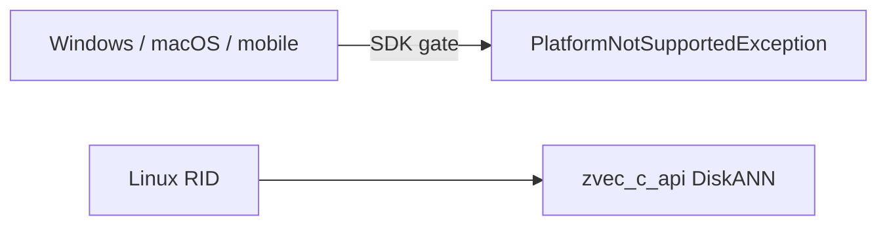

# DiskANN

## Intuition

**DiskANN** builds a graph index designed for **SSD / disk-resident** corpora that do not fit comfortably in RAM. Search walks a proximity graph while streaming compressed or paged vector data from disk. On Linux, ZVec may use **libaio** for async I/O and falls back to synchronous `pread` when it is absent.

## Math

Construction grows a directed graph with out-degree capped by \(R\) (max degree). Candidate expansion uses a search list of size \(L\) (list size). Product Quantization (PQ) can compress vectors into \(m\) subspaces (chunks); distances are approximated in code space, often with a short full-precision refine.

Schematic neighbor prune (Vamana-style \(\alpha\)-prune is related; DiskANN variants differ by paper/engine):

$$
\text{keep edge } u \to v \text{ if } d(u,v) \le \alpha \cdot d(u,p)
$$

for competing candidates \(p\) already retained — exact rules follow the DiskANN / upstream ZVec implementation.

Query cost scales with SSD bandwidth and \(L\); larger \(L\) usually improves recall.

## Illustration

```mermaid
flowchart TB
  subgraph build [Build]
    corpus[Large corpus]
    graph[Proximity graph MaxDegree]
    pq[Optional PQ codes]
    corpus --> graph
    corpus --> pq
  end
  subgraph search [Search on Linux]
    q[Query]
    ram[Hot graph / caches]
    ssd[SSD pages via aio or pread]
    q --> ram
    ram --> ssd
    ssd --> cand[Candidate list ListSize]
    cand --> topk[Top-K]
  end
  graph --> ram
  pq --> ssd
```



## Citations

- Jayaram Subramanya et al., *DiskANN: Fast Accurate Billion-point Nearest Neighbor Search on a Single Node* (NeurIPS 2019)
- Related graph construction ideas overlap with Vamana / FreshDiskANN literature
- Product docs: [zvec.org](https://zvec.org)

## ZVec.NET mapping

| Concern | SDK default / type |
|---------|-------------------|
| Build type | `ZVecDiskAnnIndexParam` |
| Metric | `ZVecDefaults.DiskAnn.MetricType` = **L2** |
| Max degree \(R\) | `MaxDegree` = **100** |
| List size \(L\) | `ListSize` = **50** (build/search candidate list) |
| PQ chunks | `PqChunkNum` = **0** (auto) |
| Quantize / rotate | `QuantizeType` Undefined; `EnableRotate` false by default |
| Query | `ZVecDiskAnnQueryParams` |
| Default query list size | `ZVecDefaults.Query.DiskAnnListSize` = **300** |
| Platform | **Linux only** — non-Linux throws `PlatformNotSupportedException` before native |
| I/O | libaio optional (`dlopen`); else synchronous `pread` |

## See also

- [Concepts: DiskANN](../concepts/diskann.md)
- [Vamana](vamana.md) (in-memory / mmap graph cousin)
- [RIDs / feature limits](../guides/rids.md)
