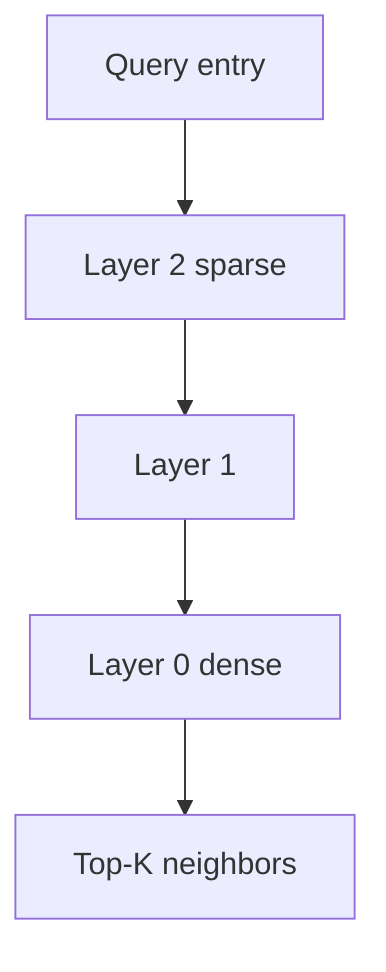

# HNSW

## Intuition

**Hierarchical Navigable Small World** graphs keep long-range links on upper layers and denser local links below. Search descends layers greedily, then expands a candidate list of size \(ef\) on the bottom layer. Larger \(M\) / \(ef_{\mathrm{construction}}\) / \(ef_{\mathrm{search}}\) usually improves recall at the cost of memory and latency.

## Math

At a high level, construction inserts each point into a random maximum layer and connects it to up to \(M\) neighbors per layer, chosen from a candidate set of size \(ef_{\mathrm{construction}}\).

Search maintains a dynamic candidate list; the bottom-layer list size is \(ef_{\mathrm{search}}\). Recall typically rises with \(ef_{\mathrm{search}}\) and saturates.

Exact layer probability and neighbor-selection rules follow the HNSW paper; ZVec’s native engine implements the production variant used upstream.

## Illustration

## Citations

- Yu. A. Malkov, D. A. Yashunin, *Efficient and robust approximate nearest neighbor search using Hierarchical Navigable Small World graphs*, arXiv:1603.09320
- Upstream product docs: [zvec.org](https://zvec.org)

## ZVec.NET mapping

| Concern | SDK default / type |
|---------|-------------------|
| Build type | `ZVecHnswIndexParam` |
| \(M\) | `ZVecDefaults.Hnsw.M` = **16** |
| \(ef_{\mathrm{construction}}\) | `ZVecDefaults.Hnsw.EfConstruction` = **200** |
| Metric | Cosine (`ZVecDefaults.Hnsw.MetricType`) |
| Quantize | `QuantizeType` default Undefined; see [Quantization](quantization.md) |
| Query | `ZVecHnswQueryParams` / `EfSearch` |
| Default \(ef_{\mathrm{search}}\) | `ZVecDefaults.Query.HnswEfSearch` = **300** |
| Typed attr | `[ZVecVector(..., M = …, EfConstruction = …)]` |
| Platform | All supported RIDs |

Prefer `includeVector: false` on query when result embeddings are unused.

## See also

- [Concepts: HNSW](../concepts/hnsw.md)
- [Hybrid guide](../guides/hybrid-fts.md)
