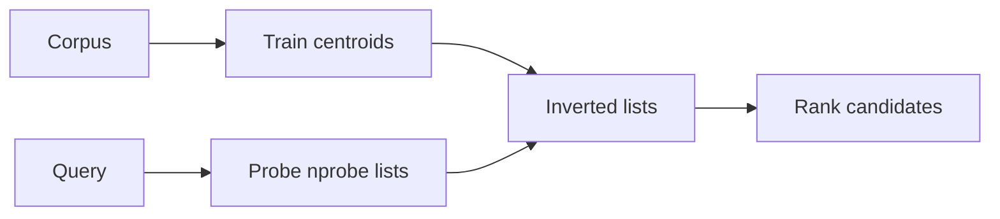
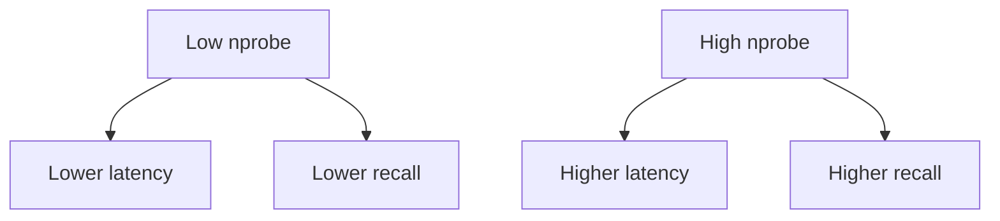

# IVF

## Intuition

**Inverted File** indexes cluster the corpus into lists (coarse quantizer). At query time only \(n_{\mathrm{probe}}\) lists are scanned. Raising \(n_{\mathrm{probe}}\) trades latency for recall.

## Math

Training finds \(K\) centroids \(\{\mathbf{c}_k\}\). Each vector is assigned to its nearest centroid (list). A query \(\mathbf{q}\) probes the \(n_{\mathrm{probe}}\) closest centroids and ranks candidates inside those lists under the chosen metric.

Coarse assignment (schematic):

$$
\mathrm{list}(\mathbf{x}) = \arg\min_k \|\mathbf{x} - \mathbf{c}_k\|
$$

Exact clustering / residual PQ details follow the native ZVec implementation and product docs.

## Illustration

## Citations

- Classic IVF/IVFPQ lineage: Jégou et al., *Product Quantization for Nearest Neighbor Search* (IEEE TPAMI)
- Upstream: [zvec.org](https://zvec.org)

## ZVec.NET mapping

| Concern | SDK default / type |
|---------|-------------------|
| Build type | `ZVecIvfIndexParam` |
| Metric | `ZVecDefaults.Ivf.MetricType` = **L2** |
| Centroids | `CentroidsNum` = **256** |
| `Nlist` | **16** |
| Build `Nprobe` field | **8** (`ZVecDefaults.Ivf.Nprobe`) |
| Query | `ZVecIvfQueryParams` |
| Default query \(n_{\mathrm{probe}}\) | `ZVecDefaults.Query.IvfNprobe` = **8** |
| Scale factor | `ZVecDefaults.Query.IvfScaleFactor` = **10.0** |
| Platform | All supported RIDs |

Tune query `Nprobe` upward if recall is low; measure latency on your corpus.

## See also

- [Concepts: IVF](../concepts/ivf.md)
- [Metrics](metrics.md)
