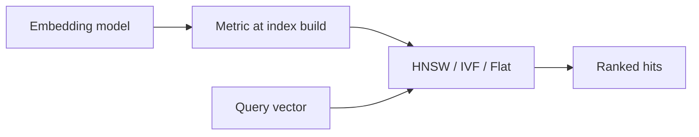

# Distance metrics

## Intuition

ANN indexes rank neighbors by a **metric**. Cosine cares about angle (direction), L2 about Euclidean distance, inner product about raw alignment (often with normalized vectors). Using the wrong metric for your embedding model destroys recall even when the index is “correct.”

## Math

For vectors \(\mathbf{u}, \mathbf{v} \in \mathbb{R}^d\):

**Cosine similarity** (higher is closer; engines often convert to a distance):

$$
\cos(\mathbf{u}, \mathbf{v}) = \frac{\mathbf{u} \cdot \mathbf{v}}{\|\mathbf{u}\|\,\|\mathbf{v}\|}
$$

**Squared / Euclidean L2** (lower is closer):

$$
\|\mathbf{u} - \mathbf{v}\|_2 = \sqrt{\sum_{i=1}^{d}(u_i - v_i)^2}
$$

**Inner product** (higher is closer when vectors are comparable in scale):

$$
\mathrm{IP}(\mathbf{u}, \mathbf{v}) = \mathbf{u} \cdot \mathbf{v}
$$

When vectors are \(\ell_2\)-normalized, maximizing IP is equivalent to maximizing cosine.

## Illustration

## Citations

- Product metrics & index docs: [zvec.org](https://zvec.org)
- Classic ANN survey context: Malkov & Yashunin, *Efficient and robust approximate nearest neighbor search using HNSW* (IEEE TPAMI / arXiv:1603.09320) — metric choice is orthogonal to graph search but must match training

## ZVec.NET mapping

| Concern | SDK |
|---------|-----|
| Enum | `ZVecMetricType` (Cosine, L2, InnerProduct, …) |
| HNSW default | `ZVecDefaults.Hnsw.MetricType` = **Cosine** |
| IVF / Flat / DiskANN / Vamana default | **L2** (`ZVecDefaults.Ivf` / `Flat` / `DiskAnn` / `Vamana`) |
| Typed attribute | `[ZVecVector(dim, Metric = ZVecMetricType.Cosine, …)]` |
| Index params | `ZVecHnswIndexParam.MetricType`, `ZVecIvfIndexParam.MetricType`, … |

Pick the metric your embedding provider documents; do not mix Cosine-trained vectors with an L2 index without validating recall.

## See also

- [Concepts overview](../concepts/index.md)
- [HNSW theory](hnsw.md)
