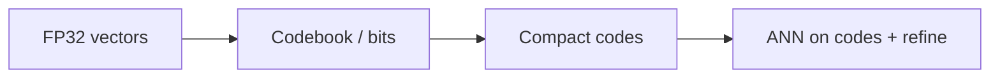

# Quantization

## Intuition

Quantization stores compact codes (INT8/INT4, product codes, or RaBitQ-style bit packs) instead of full FP32 vectors to cut memory and sometimes accelerate distance. Quality depends on training, rotation, and whether the ISA path exists on the host CPU.

## Math

Scalar / integer quantization maps each coordinate (or subspace) to a small codebook. A schematic INT8 scale:

$$
\hat{x}_i = \mathrm{round}\!\left(\frac{x_i}{s}\right), \quad \hat{x}_i \in [-128, 127]
$$

**RaBitQ** and related binary/bit-quantized ANN methods trade a few bits of precision for large memory wins; see the RaBitQ literature and upstream ZVec docs for the exact coding used in the engine.

Random rotation (`EnableRotate`) can reduce axis-aligned quantization error for some INT8/INT4 pipelines.

## Illustration

## Citations

- RaBitQ library / papers referenced by upstream ZVec (see native third_party RaBitQ docs)
- Jégou et al., Product Quantization (PQ) — foundational compressed ANN
- Product docs: [zvec.org](https://zvec.org)

## ZVec.NET mapping

| Concern | SDK |
|---------|-----|
| Quantize enum | `ZVecQuantizeType` on index params |
| Default | `ZVecDefaults.Hnsw.QuantizeType` / IVF / Flat / … = **Undefined** (no quantization) |
| INT8/INT4 rotate | `EnableRotate` default **false** (`ZVecDefaults.Quantizer.EnableRotate`) |
| HNSW-RaBitQ type | `ZVecHnswRabitqIndexParam` — defaults `M=16`, `EfConstruction=200`, `TotalBits=7`, `NumClusters=16` |
| Platform gate | RaBitQ: **x86_64 + AVX2 only** — SDK throws `PlatformNotSupportedException` on Arm |
| C API create gap | Managed create throws `NotSupportedException` until upstream exports create path — see [Native API coverage](../reference/native-api-coverage.md) |

Do not rely on RaBitQ create in production until the coverage report clears the blocker.

## See also

- [Concepts: HNSW](../concepts/hnsw.md) (RaBitQ row)
- [RIDs / feature limits](../guides/rids.md)
