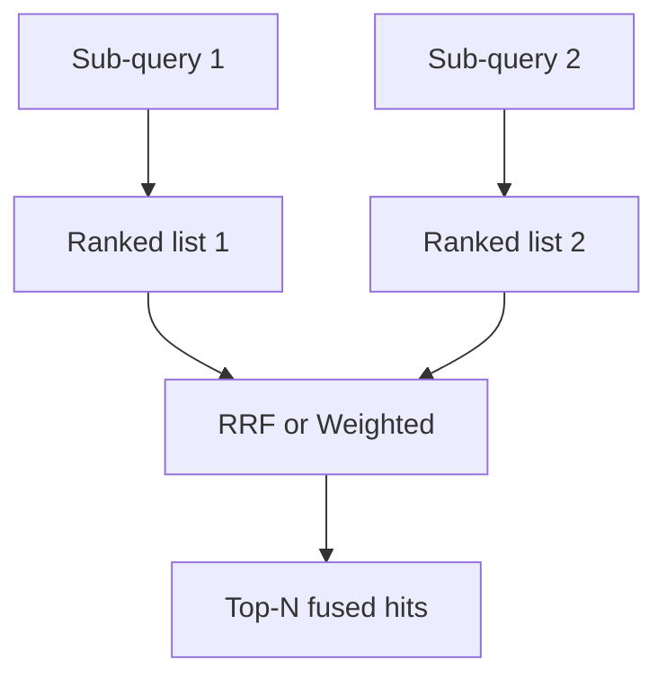

# RRF and weighted fusion

## Intuition

When you run **multiple sub-queries** (title vector + body vector, or dense + FTS), each list has its own ranking. **Reciprocal Rank Fusion (RRF)** merges by rank, not raw score, so heterogeneous scorers combine cleanly. **Weighted** fusion scales per-field scores before aggregation.

## Math

For a set of rankings \(Q\) and rank constant \(k\), RRF score of document \(d\):

$$
\mathrm{score}_{\mathrm{RRF}}(d) = \sum_{q \in Q} \frac{1}{k + r_q(d)}
$$

where \(r_q(d)\) is the 1-based rank of \(d\) in list \(q\) (absent documents contribute nothing for that \(q\)).

Weighted fusion (schematic): each sub-query score \(s_q(d)\) is multiplied by weight \(w_q\) then aggregated under a fusion metric.

## Illustration

## Citations

- Cormack, Clarke, Buettcher, *Reciprocal Rank Fusion outperforms Condorcet and individual Rank Learning Methods* (SIGIR 2009)
- Upstream hybrid / rerank docs: [zvec.org](https://zvec.org)

## ZVec.NET mapping

| Concern | SDK |
|---------|-----|
| RRF type | `ZVecRrfReranker` |
| Rank constant \(k\) | `RankConstant` default **60** (`ZVecDefaults.Rerank.RankConstant`) |
| `TopN` | Final fused count (`0` = return all merged, per XML docs) |
| Weighted type | `ZVecWeightedReranker` — `Weights` dictionary keyed by field name |
| Weight validation | `ZVecWeightedReranker.ValidateWeights` — count must match sub-query count |
| API | Multi-query `Query([...], reranker: …)` — requires **≥ 2** sub-queries |
| Guide | [Hybrid search and FTS](../guides/hybrid-fts.md) |

Group-by fusion paths remain blocked at the C API — see [coverage](../reference/native-api-coverage.md).

## See also

- [Concepts: RRF](../concepts/rrf.md)
- [Concepts: FTS](../concepts/fts.md)
