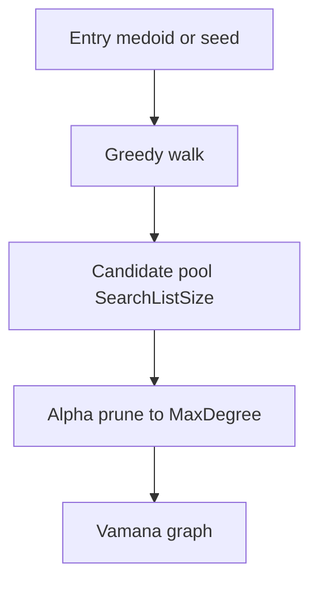
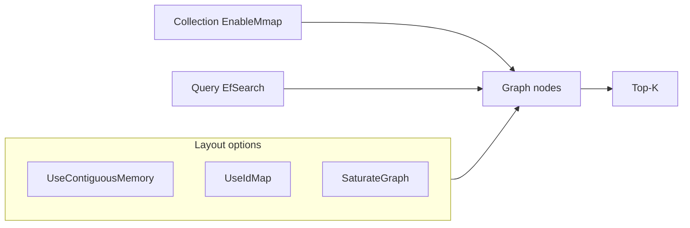

# Vamana

## Intuition

**Vamana** is a single-layer proximity graph ANN index with an \(\alpha\)-controlled neighbor prune. Compared with multi-layer [HNSW](hnsw.md), it exposes a flatter graph with explicit degree, search-list, and layout knobs. In ZVec it is often paired with **mmap / out-of-core** friendly layouts (`UseContiguousMemory`, `UseIdMap`, `EnableMmap` on the collection).

## Math

During construction, a greedy search with candidate pool size \(L\) gathers neighbors; an \(\alpha\)-prune (\(\alpha \ge 1\)) keeps a diverse out-neighborhood of size at most \(R\):

$$
\text{retain } v \text{ if } d(p,v) > \frac{d(p,u)}{\alpha}
$$

(schematic; \(u\) already selected, \(p\) the pivot — exact predicate follows the Vamana paper / engine).

Larger \(\alpha\) keeps longer edges (better navigation, denser effective graph). Search expands a frontier of size \(L\) (search list / \(ef\)-like parameter).

## Illustration

## Citations

- Jayaram Subramanya et al., *DiskANN* (NeurIPS 2019) — introduces the Vamana graph used in the DiskANN pipeline
- Fresh / in-memory Vamana variants in subsequent Microsoft / ANN literature
- Product docs: [zvec.org](https://zvec.org)

## ZVec.NET mapping

| Concern | SDK default / type |
|---------|-------------------|
| Build type | `ZVecVamanaIndexParam` |
| Metric | `ZVecDefaults.Vamana.MetricType` = **L2** |
| Max degree \(R\) | `MaxDegree` = **64** |
| Search list \(L\) (build) | `SearchListSize` = **100** |
| \(\alpha\) | `Alpha` = **1.2** |
| Saturate graph | `SaturateGraph` = **false** |
| Contiguous memory | `UseContiguousMemory` = **false** |
| ID map | `UseIdMap` = **false** |
| Quantize / rotate | Undefined / `EnableRotate` false by default |
| Query | `ZVecVamanaQueryParams` |
| Default query \(ef_{\mathrm{search}}\) | `ZVecDefaults.Query.VamanaEfSearch` = **200** |
| Platform | All supported RIDs (subject to upstream limits) |
| Collection mmap | `ZVecDefaults.CollectionOptions.EnableMmap` = **true** |

Validate recall on your embedding distribution before swapping HNSW → Vamana in production.

## See also

- [Concepts: Vamana](../concepts/vamana.md)
- [DiskANN](diskann.md)
- [HNSW](hnsw.md)
